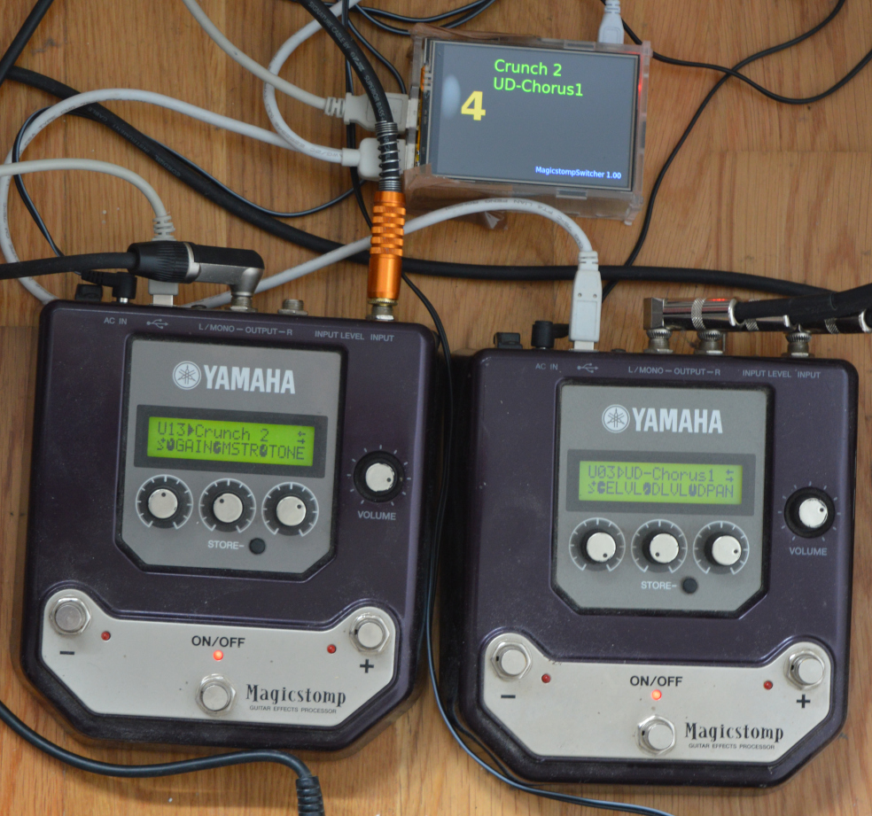

# MagicstompSwitcher for Linux

## Introduction

MagicstompSwitcher i an application for Linux which makes it possible to switch patches of Yamaha's Magicstomp using MIDI Program Change Messages sent from a MIDI foot controller or any other MIDI device. It will work on any Linux system with ALSA and Qt library installed on it. It will fulfill its purpose the best on a small Linux host like Raspberry PI which can be easily mounted on a pedalboard or rack.

## How it works

At startup the app scans for all connected Magicstomps and copies all user patches of each of them into its memory. It also scans for other hardware MIDI devices ( or interfaces to which a MIDI Foot Controller can be connected ). Incoming Program Change messages will trigger sending according patch to each Magictomp using SysEx messages. The app supports hot plugging, means connecting or disconnecting the devices does not require any restart.

## How to build

The simplest way is to build the app directly on the host system, no cross platform building is needed then. You will need default C++ toolchain, cmake, qt development packages ( core and widgets) and alsa development package on the system in order to build the app. As the project uses cmake the app will be built just like any cmake project. 

